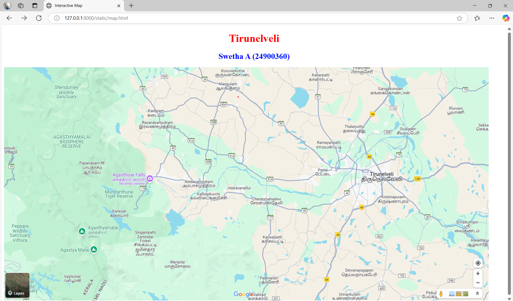
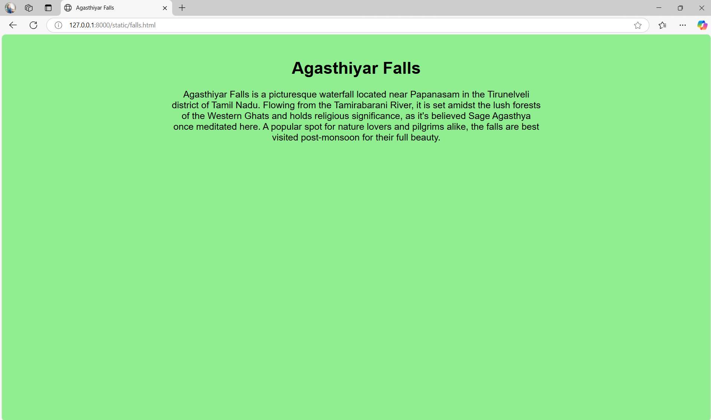
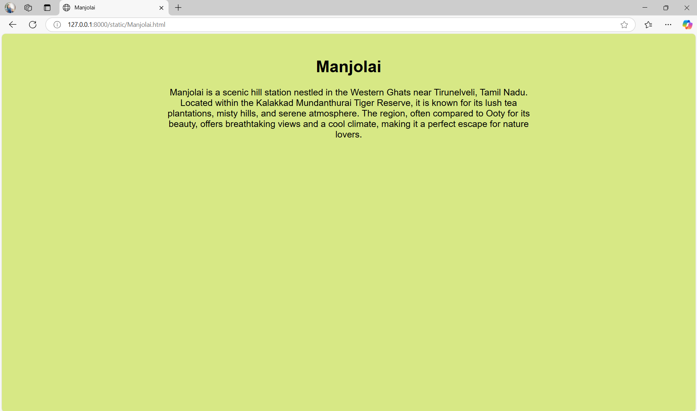
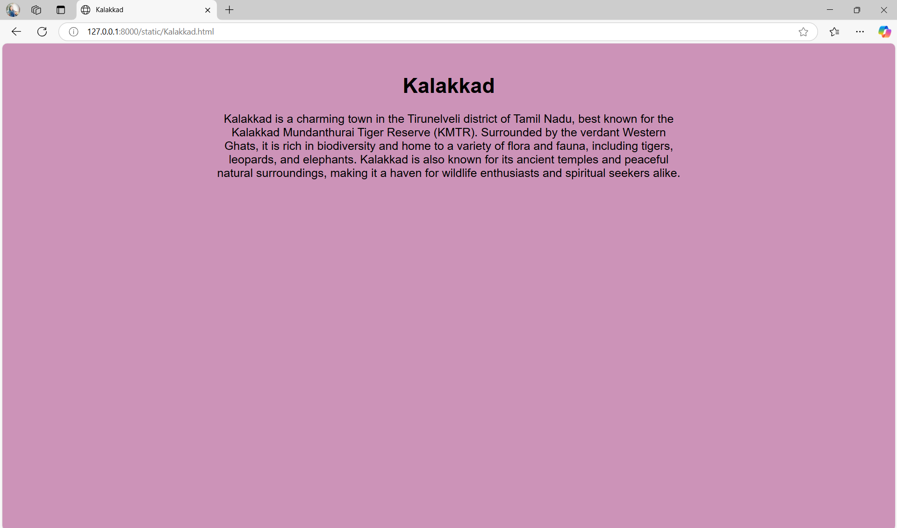
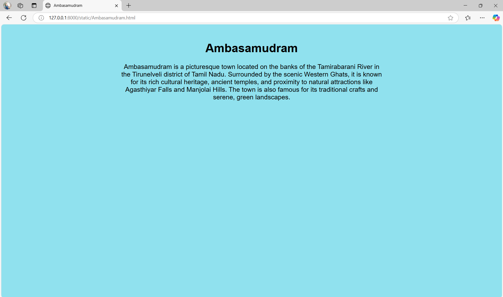
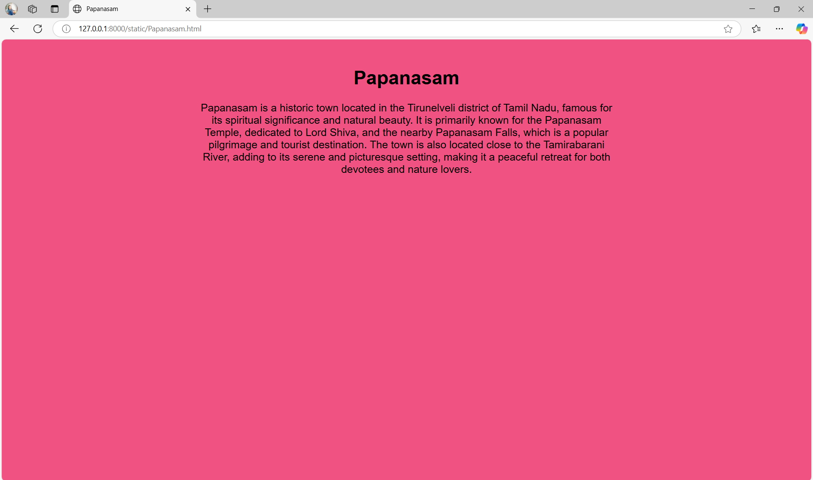

# Ex04 Places Around Me
# Date:12/04/25
# AIM
To develop a website to display details about the places around my house.

# DESIGN STEPS
## STEP 1
Create a Django admin interface.

## STEP 2
Download your city map from Google.

## STEP 3
Using <map> tag name the map.

## STEP 4
Create clickable regions in the image using <area> tag.

## STEP 5
Write HTML programs for all the regions identified.

## STEP 6
Execute the programs and publish them.

# CODE
```
map.html

<!DOCTYPE html>
<html>
<head>
    <!DOCTYPE html>
<html>
<head>
    <title>Interactive Map</title>
</head>
<body>
    <h1 style="text-align:center; color:red;">Tirunelveli</h1>
    <h2 style="text-align:center; color:blue;">Swetha A (24900360)</h2>

    

    

    <map name="MyCity">
            <area alt="Agasthiyar Falls" title="Agasthiyar Falls" href="falls.html" coords="344,388,78" shape="circle">
            <area alt="Manjolai" title="Manjolai" href="Manjolai.html" coords="588,739,114" shape="circle">
            <area alt="Kalakkad" title="Kalakkad" href="Kalakkad.html" coords="847,867,114" shape="circle">
            <area alt="Ambasamudram" title="Ambasamudram" href="Ambasamudram.html" coords="599,442,86" shape="circle">
            <area alt="Papanasam" title="Papanasam" href="Papanasam.html" coords="227,403,114" shape="circle">
        </map>
        
</body>
</html>

falls.html

<!DOCTYPE html>
<html>
<head>
    <title>Agasthiyar Falls</title>
    <style>
        body {
            background-color: lightgreen;
            font-family: Arial, sans-serif;
            text-align: center;
            padding: 20px;
        }
        h1 {
            font-size: 36px;
        }
        p {
            font-size: 20px;
            max-width: 800px;
            margin: 0 auto;
        }
    </style>
</head>
<body>
    <h1>Agasthiyar Falls</h1>
    <p>
        Agasthiyar Falls is a picturesque waterfall located near Papanasam in the Tirunelveli district of Tamil Nadu. 
        Flowing from the Tamirabarani River, it is set amidst the lush forests of the Western Ghats and holds religious 
        significance, as it's believed Sage Agasthya once meditated here. A popular spot for nature lovers and pilgrims 
        alike, the falls are best visited post-monsoon for their full beauty.
    </p>
</body>
</html>

Manjolai.html
<!DOCTYPE html>
<html>
<head>
    <title>Manjolai</title>
    <style>
        body {
            background-color:  rgba(206, 227, 105, 0.815);
            font-family: Arial, sans-serif;
            text-align: center;
            padding: 20px;
        }
        h1 {
            font-size: 36px;
        }
        p {
            font-size: 20px;
            max-width: 800px;
            margin: 0 auto;
        }
    </style>
</head>
<body>
    <h1>Manjolai</h1>
    <p>
        Manjolai is a scenic hill station nestled in the Western Ghats near Tirunelveli, Tamil Nadu. Located within the Kalakkad Mundanthurai Tiger Reserve, it is known for its lush tea plantations, misty hills, and serene atmosphere. The region, often compared to Ooty for its beauty, offers breathtaking views and a cool climate, making it a perfect escape for nature lovers.


    </p>
</body>
</html>

Kalakkad.html
<!DOCTYPE html>
<html>
<head>
    <title>Kalakkad</title>
    <style>
        body {
            background-color:  rgba(193, 122, 168, 0.815);
            font-family: Arial, sans-serif;
            text-align: center;
            padding: 20px;
        }
        h1 {
            font-size: 36px;
        }
        p {
            font-size: 20px;
            max-width: 800px;
            margin: 0 auto;
        }
    </style>
</head>
<body>
    <h1>Kalakkad</h1>
    <p>
        Kalakkad is a charming town in the Tirunelveli district of Tamil Nadu, best known for the Kalakkad Mundanthurai Tiger Reserve (KMTR). Surrounded by the verdant Western Ghats, it is rich in biodiversity and home to a variety of flora and fauna, including tigers, leopards, and elephants. Kalakkad is also known for its ancient temples and peaceful natural surroundings, making it a haven for wildlife enthusiasts and spiritual seekers alike.

    </p>
</body>
</html>

Ambasamudran.html

<!DOCTYPE html>
<html>
<head>
    <title>Ambasamudram</title>
    <style>
        body {
            background-color: rgb(144, 225, 238);
            font-family: Arial, sans-serif;
            text-align: center;
            padding: 20px;
        }
        h1 {
            font-size: 36px;
        }
        p {
            font-size: 20px;
            max-width: 800px;
            margin: 0 auto;
        }
    </style>
</head>
<body>
    <h1>Ambasamudram</h1>
    <p>
        Ambasamudram is a picturesque town located on the banks of the Tamirabarani River in the Tirunelveli district of Tamil Nadu. Surrounded by the scenic Western Ghats, it is known for its rich cultural heritage, ancient temples, and proximity to natural attractions like Agasthiyar Falls and Manjolai Hills. The town is also famous for its traditional crafts and serene, green landscapes.


    </p>
</body>
</html>

Papanasam.html

<!DOCTYPE html>
<html>
<head>
    <title>Papanasam</title>
    <style>
        body {
            background-color:  rgba(236, 43, 101, 0.815);
            font-family: Arial, sans-serif;
            text-align: center;
            padding: 20px;
        }
        h1 {
            font-size: 36px;
        }
        p {
            font-size: 20px;
            max-width: 800px;
            margin: 0 auto;
        }
    </style>
</head>
<body>
    <h1>Papanasam</h1>
    <p>
        Papanasam is a historic town located in the Tirunelveli district of Tamil Nadu, famous for its spiritual significance and natural beauty. It is primarily known for the Papanasam Temple, dedicated to Lord Shiva, and the nearby Papanasam Falls, which is a popular pilgrimage and tourist destination. The town is also located close to the Tamirabarani River, adding to its serene and picturesque setting, making it a peaceful retreat for both devotees and nature lovers.


    </p>
</body>
</html>

```
# OUTPUT







# RESULT
The program for implementing image maps using HTML is executed successfully.
